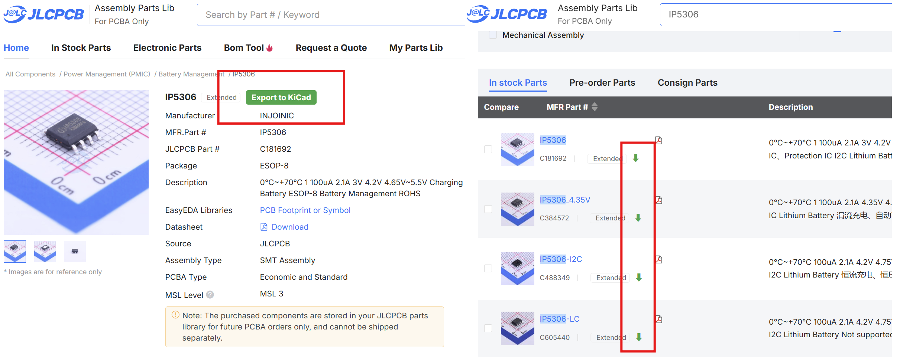
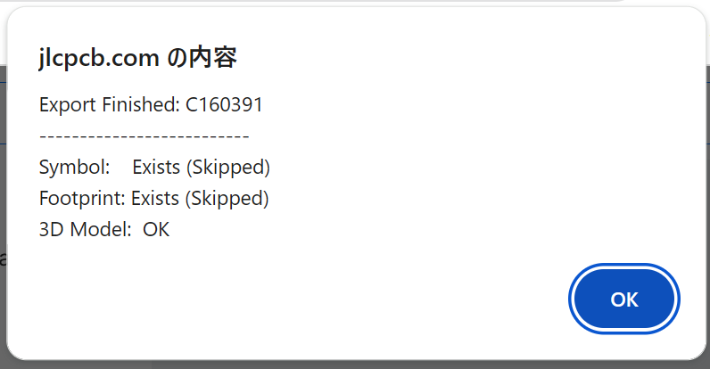

# EasyEDA2KiCad Chrome Extension

**JLCPCB** や **LCSC** のパーツページから、電子部品を直接 **KiCad** ライブラリ（シンボル、フットプリント、3Dモデル）にエクスポートするChrome拡張機能です。

このプロジェクトは [uPesy/easyeda2kicad.py](https://github.com/uPesy/easyeda2kicad.py) をベースにしています。Chrome 拡張機能とローカルサーバーの連携で、部品検索からKiCadライブラリへの反映までが最短で行えます。

---

## インストール方法

### 1. ローカルサーバー
1. [リリーズページ](https://github.com/minolabo/EasyEDA2KiCad-Chrome-Extension/releases)から最新の `EasyEDA2KiCad_Server.exe` をダウンロードします。
2. ダウンロードした EXE ファイルを実行します（セキュリティ警告が表示された場合はアクセスを許可してください）。
3. サーバーが起動すると、黒い画面が表示されます。ライブラリに部品を追加する作業中はこの画面を閉じないでください。

### 2. Chrome 拡張機能
1. Chrome ブラウザで `chrome://extensions` を開きます。
2. 右上の「デベロッパー モード」を有効にします。
3. 「パッケージ化されていない拡張機能を読み込む」をクリックし、このリポジトリの `chrome_extension` フォルダを選択します。

### 3. KiCadの設定
3Dモデルのパスが環境変数で設定されるため、この作業は必須です。試しに1モデルだけエクスポートして、プロパティを確認してもらうと理解しやすいと思います。
1. Chrome拡張機能のアイコンをクリックし、設定を開きます。
2. 設定画面の「Output Directory」に、出力パスとライブラリ名を設定します。
3. KiCad のパス設定で、出力パスとライブラリ名を追加します。フォルダを選択した後、最後に¥記号を追加するのを忘れないでください。
4. 何でも構わないので、使う予定のアイテムを1つだけエクスポートします。ライブラリが新規作成されます。
    - [JLCPCB](https://jlcpcb.com/) または [LCSC](https://www.lcsc.com/) の製品詳細ページを開くと、**Export to KiCad** ボタンが表示されます。
    - 検索結果ページでは、各パーツ番号の横にダウンロードアイコン（⬇）が表示されます。
5. シンボルエディタのライブラリ設定でシンボルライブラリ(.kicad_sym)を登録します(グローバルでもプロジェクトでも構いません)。
6. フットプリントエディタのライブラリ設定でフットプリントライブラリ(.pretty)を登録します(同上)。3Dモデルは3のパス設定が正しければ、自動で表示されます。

---

## ライセンス

このプロジェクトはオリジナルの [uPesy/easyeda2kicad.py](https://github.com/uPesy/easyeda2kicad.py) に基づいており、**GNU Affero General Public License v3.0 (AGPL-3.0)** の下で公開されています。

詳細は [LICENSE](LICENSE) ファイルを参照してください。

---

## 免責事項

変換されたシンボルおよびフットプリントの正確性は保証されません。設計に使用する前に、フットプリントの寸法やシンボルのピン配置が実際のコンポーネントと一致しているか、必ず再確認してください。
既知のバグとして、3DモデルのXYZ座標がズレている場合があります。これらは手動で修正が必要です。

---

# EasyEDA2KiCad Chrome Extension

A Chrome extension to directly export electronic components from **JLCPCB** and **LCSC** to **KiCad** libraries (Symbol, Footprint, 3D Model).

This project is based on the original [uPesy/easyeda2kicad.py](https://github.com/uPesy/easyeda2kicad.py). The collaboration between the Chrome Extension and the local server allows for the fastest workflow from part search to KiCad library reflection.

---

## Installation

### 1. Local Server
1. Download the latest `EasyEDA2KiCad_Server.exe` from the [Releases](https://github.com/minolabo/EasyEDA2KiCad-Chrome-Extension/releases) page.
2. Run the downloaded EXE file (you may need to allow access if prompted by security warnings).
3. When the server starts, a terminal (black screen) will appear. Do not close this window while you are adding components to your library.

### 2. Chrome Extension
1. Open `chrome://extensions` in the Chrome browser.
2. Enable "Developer mode" in the top right corner.
3. Click "Load unpacked" and select the `chrome_extension` folder in this repository.

### 3. KiCad Configuration
This step is essential because 3D model paths are set via environment variables. It's best to export one model first and check its properties to understand how it works.
1. Click the Chrome Extension icon and open the settings.
2. Set the "Output Directory" and "Library Name" in the settings screen.
3. In KiCad's Path configuration, add the output path and library name. After selecting the folder, don't forget to add a backslash (`\`) at the end.
4. Export any item you plan to use; this will create a new library.
    - Open a product detail page on [JLCPCB](https://jlcpcb.com/) or [LCSC](https://www.lcsc.com/), and an **Export to KiCad** button will appear.
    - On search result pages, download icons (⬇) will appear next to each part number.
5. Register the symbol library (`.kicad_sym`) in the Symbol Editor's library settings (either Global or Project).
6. Register the footprint library (`.pretty`) in the Footprint Editor's library settings (same as above). 3D models will be displayed automatically if the path settings in step 3 are correct.

---

## License

This project follows the original [uPesy/easyeda2kicad.py](https://github.com/uPesy/easyeda2kicad.py) and is released under the **GNU Affero General Public License v3.0 (AGPL-3.0)**.

See the [LICENSE](LICENSE) file for details.

---

## Disclaimer

The accuracy of converted symbols and footprints cannot be guaranteed. Always double-check footprint dimensions and symbol pin assignments against the actual component before using them in your designs.
As a known bug, the XYZ coordinates of 3D models may be offset. These require manual correction.
